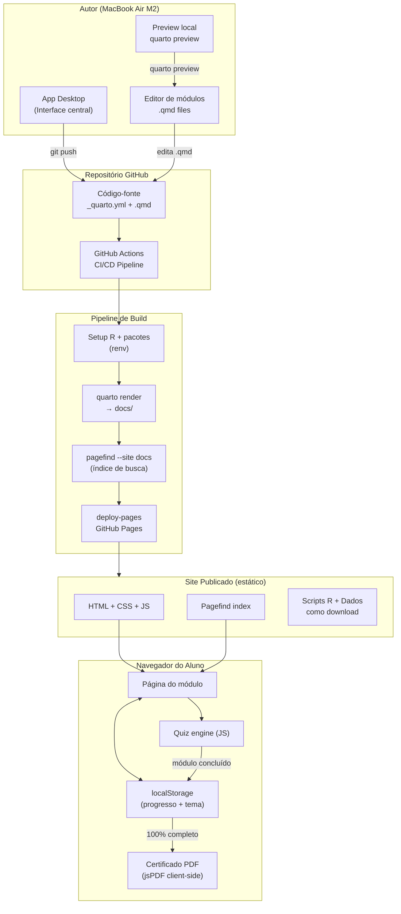
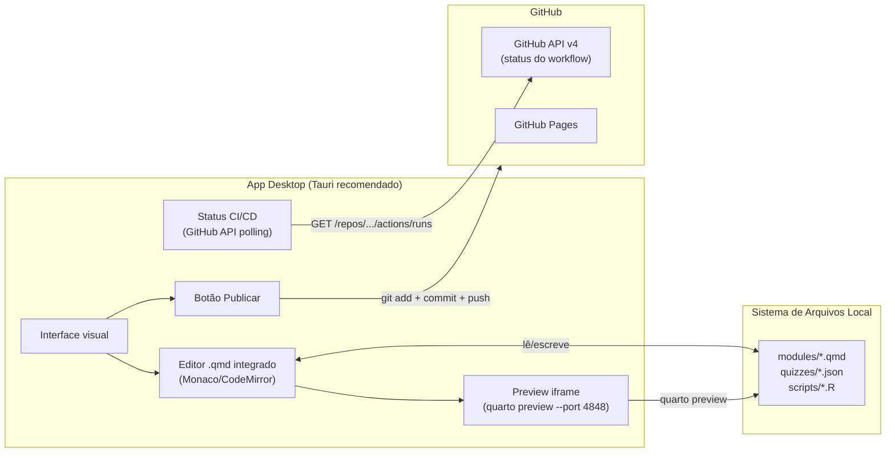

# MGenética — Plano de Evolução para Plataforma Profissional

> Gerado em 2026-05-04. Documento de referência para evolução do site MGenética Academy.

---

## 1. Visão Geral do Projeto

### Nome sugerido
**MGenética Academy** — mantém a identidade já estabelecida, acrescenta o peso de uma plataforma estruturada. Subline recomendado: *"Melhoramento animal, do conceito ao código."*

### Objetivos principais

| # | Objetivo | Métrica de sucesso |
|---|----------|-------------------|
| 1 | Elevar percepção de qualidade ao nível de cursos pagos | Visual comparável a DataCamp/Posit Academy |
| 2 | Engajar alunos com interatividade real | Quizzes, visualizações dinâmicas, exercícios avaliáveis |
| 3 | Permitir progresso rastreável e certificável | Badge/certificado por módulo concluído |
| 4 | Tornar o conteúdo dos módulos substancial | Sair do placeholder para conteúdo técnico real |
| 5 | Integrar ao app desktop para gestão centralizada | Edição → preview → publish em um clique |

### Benefícios esperados

**Para alunos:**
- Experiência de aprendizado contínua e motivadora (saber onde estão na trilha)
- Feedback imediato via quizzes embutidos
- Código R executável e reproduzível sem configuração local
- Material visualmente profissional que reflete a seriedade do conteúdo

**Para o autor:**
- Zero custo de hospedagem permanente (GitHub Pages)
- Publicação automática a cada `git push`
- App desktop como painel central de edição e monitoramento
- Portfólio de alto impacto para pesquisa, orientação e divulgação científica

---

## 2. Análise do Site Atual

### Pontos fortes
- **Design system iniciado bem**: paleta navy/branco consistente, variáveis CSS organizadas, responsividade básica implementada
- **CI/CD funcional**: GitHub Actions publicando automaticamente — base sólida
- **Arquitetura Quarto correta**: sidebar + navbar + TOC, estrutura modular com `modules/`, `scripts/`, `data/`
- **12 módulos cobertos**: progressão temática bem planejada, do conceito biológico até genômica
- **Branding nascente**: logo, kicker, hero section, metric-grid — elementos de plataforma já esboçados

### Fraquezas críticas

| Problema | Impacto |
|----------|---------|
| Módulos com conteúdo placeholder | O site parece protótipo, não curso |
| Sem dark mode | Padrão obrigatório em 2026 para plataformas técnicas |
| Sem interatividade | Leitura passiva = baixo engajamento, alta evasão |
| Sem rastreamento de progresso | Aluno não sabe o que já fez |
| CSS do hero só na home | Páginas dos módulos são texto puro sem identidade visual |
| Scripts R com `eval: false` | Nenhum output renderizado — o aluno vê código morto |
| Sem busca robusta | Busca do Quarto é básica |
| Sem metadados SEO/OG | Compartilhamento social sem card visual |

### Oportunidades
- Quizzes via JavaScript puro (estático, sem backend)
- Observable Plot ou Plotly para visualizações interativas
- Pagefind para busca full-text estática de alta qualidade
- Progress tracking via localStorage (100% client-side)
- Certificado como PDF gerado client-side (jsPDF)

---

## 3. Requisitos Funcionais e Não-Funcionais

### Funcionais (RF)

**Navegação e estrutura**
- RF01: Sidebar com indicador visual de módulo atual e progresso por item
- RF02: Breadcrumb em todas as páginas de módulo
- RF03: Botões "Módulo anterior / Próximo módulo" com preview do título
- RF04: Página de trilha visual interativa (mapa de progresso)
- RF05: Busca full-text em todo o conteúdo (Pagefind)

**Conteúdo e código**
- RF06: Todos os módulos com conteúdo técnico real (não placeholder)
- RF07: Código R renderizado com outputs visíveis onde didaticamente relevante
- RF08: Callouts padronizados: Conceito, Atenção, Dica R, Interpretação
- RF09: Visualizações interativas em módulos-chave (02, 04, 05, 07, 08, 12)
- RF10: Bloco de "objetivo do módulo" no topo de cada página

**Interatividade**
- RF11: Quiz de 3–5 questões ao final de cada módulo (client-side, localStorage)
- RF12: Progress tracking: módulo marcado como concluído ao completar quiz
- RF13: Barra de progresso global visível na sidebar
- RF14: Certificado de conclusão gerado client-side ao completar todos os módulos

**Identidade e marca**
- RF15: Dark mode com toggle persistente (localStorage)
- RF16: Open Graph tags para compartilhamento social com card visual
- RF17: Favicon otimizado + web manifest para instalação como PWA
- RF18: Página "Sobre o curso" com credenciais do autor

### Não-Funcionais (RNF)

| Categoria | Requisito | Meta |
|-----------|-----------|------|
| Performance | Lighthouse score | > 90 em todas as dimensões |
| Performance | Tempo de carregamento (LCP) | < 2s em 4G |
| Acessibilidade | WCAG 2.1 | Nível AA mínimo |
| SEO | Structured data + sitemap | Indexado pelo Google |
| Custo | Hospedagem | Zero (GitHub Pages) |
| Manutenção | Fluxo de publicação | Push → deploy em < 3 min |
| Compatibilidade | Browsers | Chrome, Firefox, Safari, Edge (últimas 2 versões) |
| Mobile | Responsividade | Funcional em 375px+ |
| Reproduzibilidade | Scripts R | Executáveis com `renv` travado |

---

## 4. Arquitetura Técnica Recomendada

### Stack

```
Quarto (base principal)          ← Mantido. Inegociável pela reproducibilidade R.
├── Tema: customizado (cosmo base + SCSS extenso)
├── Extensões Quarto:
│   ├── quarto-ext/fontawesome   ← ícones inline sem CDN pesado
│   └── quarto-ext/animate       ← animações de entrada (opcional)
├── JavaScript (vanilla, sem framework):
│   ├── quiz.js                  ← quizzes com localStorage
│   ├── progress.js              ← rastreamento de módulos
│   ├── darkmode.js              ← toggle de tema
│   └── certificate.js           ← geração de certificado (jsPDF CDN)
├── Pagefind                     ← busca full-text estática (pós-build)
├── Observable Plot              ← visualizações interativas (CDN, por módulo)
└── GitHub Actions               ← CI/CD mantido, adiciona passo Pagefind
```

### Diagrama de arquitetura (Mermaid)



---

## 5. Novas Funcionalidades Profissionais

### 5.1 Sistema de Quiz (client-side, zero backend)

Cada módulo termina com um bloco HTML/JS que carrega questões de um array local. Ao responder corretamente, o `localStorage` marca o módulo como `completed`.

```html
<!-- Uso no .qmd -->
::: {.quiz-container data-module="05"}
:::
```

### 5.2 Progress Tracker na Sidebar

A sidebar exibe barra de progresso global (`X/12 módulos`) e indicador por item:
- ✓ verde = concluído (localStorage)
- ◉ azul = atual
- ○ vazio = não iniciado

### 5.3 Visualizações Interativas por Módulo

| Módulo | Visualização | Biblioteca |
|--------|-------------|------------|
| 02 — Genética Quantitativa | Distribuição P = G + E (sliders) | Observable Plot |
| 04 — Variâncias | Decomposição VP em VG + VA + VE | Observable Plot |
| 05 — Herdabilidade | Regressão pai-filho com h² ajustável | Observable Plot |
| 07 — Modelos Mistos | Ajuste de curva de lactação interativo | Plotly.js |
| 08 — BLUP | Ranking de DEP com toggle entre animais | Observable Plot |
| 12 — Genômica | Manhattan plot GWAS simplificado | Plotly.js |

### 5.4 Certificado de Conclusão

Ao completar os 12 módulos, botão "Gerar Certificado" usa jsPDF para criar PDF client-side com nome do curso, data, assinatura visual do autor e QR code do site.

### 5.5 Dark Mode

Toggle no navbar (ícone lua/sol). Implementado via CSS custom properties + classe `.dark` no `<html>`. Persistido em localStorage.

```scss
html.dark {
  --mg-bg:      #0f1117;
  --mg-bg-soft: #161b22;
  --mg-text:    #e6edf3;
  --mg-line:    #30363d;
  // ...
}
```

### 5.6 Busca Full-text com Pagefind

```yaml
# workflow — adicionar após quarto render:
# npx pagefind --site docs --output-subdir _pagefind
```

### 5.7 SEO e Compartilhamento

```yaml
# _quarto.yml
website:
  open-graph:
    image: images/og-card.png
    description: "Curso aberto de melhoramento animal com R"
  twitter-card:
    card-style: summary_large_image
```

---

## 6. Estrutura de Pastas Completa

```
mgenetica/
│
├── _quarto.yml                    # Configuração principal
├── _variables.yml                 # Variáveis reutilizáveis (autor, versão)
├── renv.lock                      # Dependências R travadas
│
├── index.qmd                      # Home (landing page)
├── sobre.qmd                      # Sobre o curso e o autor
├── perfil.qmd                     # Perfil do autor
├── certificado.qmd                # Página de geração de certificado
│
├── modules/                       # Conteúdo dos 12 módulos
│   ├── modulo01-introducao-ao-melhoramento-animal.qmd
│   └── ... (12 arquivos)
│
├── quizzes/                       # Dados dos quizzes (JSON por módulo)
│   ├── quiz-01.json
│   └── ... (12 arquivos)
│
├── scripts/                       # Scripts R reproduzíveis
│   ├── modulo01.R … modulo12.R
│   ├── run_all_modules.R
│   └── utils.R
│
├── data/                          # Dados simulados
│
├── assets/                        # Recursos estáticos
│   └── js/
│       ├── quiz.js
│       ├── progress.js
│       ├── darkmode.js
│       └── certificate.js
│
├── images/
│   ├── mgenetica-logo-correct.png
│   ├── mgenetica-logo-dark.svg    # Variante dark mode
│   ├── og-card.png                # Card Open Graph 1200×630
│   └── favicon/
│       ├── favicon.ico
│       ├── apple-touch-icon.png
│       └── site.webmanifest
│
├── _extensions/
│   └── quarto-ext/fontawesome/
│
├── styles/                        # SCSS modular (substitui styles.css único)
│   ├── _variables.scss
│   ├── _base.scss
│   ├── _navbar.scss
│   ├── _sidebar.scss
│   ├── _hero.scss
│   ├── _cards.scss
│   ├── _quiz.scss
│   ├── _progress.scss
│   ├── _dark.scss
│   └── main.scss
│
├── semanas/
│   └── index.qmd
│
└── .github/
    └── workflows/
        └── quarto-publish.yml
```

---

## 7. Design System & Estilo Visual

### Tipografia

```scss
--font-sans: "Inter", -apple-system, BlinkMacSystemFont, sans-serif;
--font-mono: "JetBrains Mono", "Fira Code", "Cascadia Code", monospace;
--font-serif: "Lora", Georgia, serif;
```

### Paleta completa

```scss
// Light mode (expandida a partir da paleta atual)
--mg-navy:        #0d2642;
--mg-navy-700:    #1a3d5c;
--mg-navy-900:    #061626;
--mg-blue:        #2563a8;
--mg-blue-soft:   #e8f1f8;
--mg-cyan:        #4a9fd1;
--mg-green:       #16a34a;   // Sucesso, quiz correto
--mg-amber:       #d97706;   // Atenção, callout warning
--mg-red:         #dc2626;   // Erro, quiz incorreto

// Dark mode (novo)
--mg-bg:          #0f1117;
--mg-bg-soft:     #161b22;
--mg-bg-tint:     #1c2430;
--mg-text:        #e6edf3;
--mg-muted:       #8b949e;
--mg-line:        #30363d;
```

### Header rico por módulo

Cada módulo ganha:
- Badge de número e categoria (ex: `MÓDULO 05 · Parâmetros Genéticos`)
- Título em grande
- Box de "O que você vai aprender" (lista de objetivos)
- Barra de progresso do módulo
- Tempo estimado de leitura

### Callouts padronizados

```markdown
::: {.callout-note .conceito}
**Conceito central:** ...
:::

::: {.callout-tip .dica-r}
**Dica R:** ...
:::

::: {.callout-warning .atencao}
**Atenção:** ...
:::

::: {.callout-important .interpretacao}
**Interpretação:** ...
:::
```

---

## 8. Roadmap de Implementação

### Fase 0 — Fundação (1–2 semanas) `MVP técnico`

- [x] Migrar `styles.css` para SCSS modular em `styles/`
- [x] Implementar dark mode (CSS + `darkmode.js` + toggle no navbar)
- [x] Adicionar Inter via `@import` no SCSS
- [x] Criar `og-card.png` e adicionar metadados OG no `_quarto.yml`
- [x] Adicionar Pagefind ao workflow do GitHub Actions
- [x] Criar `assets/js/progress.js` e sidebar com indicadores
- [x] Otimizar logo para dark mode (`mgenetica-logo-dark.svg`)
- [x] Adicionar favicon completo + `site.webmanifest`

**Resultado:** Site visualmente profissional, buscável, com dark mode.

---

### Fase 1 — Conteúdo Real (4–8 semanas) `Versão 1.0`

- [x] Escrever conteúdo técnico real para todos os 12 módulos
- [x] Renderizar os scripts R com outputs visíveis (plots, tabelas)
- [x] Adicionar header rico em cada módulo
- [x] Criar callouts padronizados em cada módulo
- [x] Adicionar navegação anterior/próximo com preview do título
- [x] Criar `quizzes/quiz-NN.json` para cada módulo (3–5 questões)
- [x] Implementar `quiz.js` e integrar nos módulos
- [x] Conectar conclusão de quiz ao progress tracker
- [x] Criar página `certificado.qmd` com geração PDF (jsPDF)
- [x] Travar dependências R com `renv`

**Resultado:** Curso funcional completo, com conteúdo, quizzes e certificado.

---

### Fase 2 — Interatividade Avançada (3–4 semanas) `Versão 1.5`

- [x] Visualização interativa no Módulo 02 (distribuição P = G + E)
- [x] Visualização interativa no Módulo 05 (regressão pai-filho, h² slider)
- [x] Visualização interativa no Módulo 08 (ranking BLUP)
- [x] Manhattan plot no Módulo 12 (Observable Plot ou Plotly)
- [x] Página de trilha visual com mapa de progresso (SVG interativo)
- [x] Glossário técnico searchable
- [x] Modo "professor": toggle que revela gabarito e comentários

**Resultado:** Diferencial competitivo real frente a cursos similares.

---

### Fase 3 — Plataforma (futuro) `Versão 2.0`

- [ ] Integração total com app desktop
- [ ] Analytics (Plausible ou Umami — zero custo, LGPD-compliant)
- [ ] Fórum via GitHub Discussions embeddado
- [ ] Exercícios com WebR (R no browser, zero servidor)
- [ ] Versão em inglês (i18n Quarto)
- [ ] PDF offline do curso completo (Quarto book format em paralelo)

---

## 9. Guia de Integração com o App Desktop

### Arquitetura de integração



### O que o app deve gerenciar

**1. Dashboard de módulos**
```
Módulo 01 — Introdução          ✓ Publicado    Conteúdo: Real    Quiz: ✓
Módulo 05 — Herdabilidade       ✓ Publicado    Conteúdo: Rascun  Quiz: ✗
Módulo 09 — Pedigree            ○ Rascunho     Conteúdo: Place.  Quiz: ✗
```

**2. Fluxo de publicação**
```
[Editar] → [Preview Local] → [Publicar]
                                  ↓
                         git add + commit + push
                                  ↓
                    [Aguardando CI...] ← polling GitHub API a cada 30s
                                  ↓
                         [✓ Publicado em ~2min]
```

**3. Stack recomendada para o app**

Tauri (Rust + WebView) — melhor para M2: binário ~5MB, sem Electron overhead.

```
app-mgenetica/
├── src-tauri/
│   └── commands.rs     # git_push(), quarto_preview(), read_module_status()
└── src/                # Frontend (Svelte ou React)
    ├── Dashboard.svelte
    ├── Editor.svelte
    └── Publish.svelte
```

---

## 10. Considerações Finais

### Performance
- Quarto gera HTML estático otimizado nativamente
- Observable Plot e Plotly carregados apenas nos módulos que os usam
- Pagefind usa Web Workers — busca sem bloquear thread principal
- jsPDF carregado apenas na página de certificado

### SEO
```yaml
# _quarto.yml
website:
  description: "Curso aberto de melhoramento animal, genética quantitativa e genômica aplicada com R. 12 módulos progressivos, scripts reproduzíveis e dados simulados."
  favicon: images/favicon/favicon.ico
```

Sitemap gerado automaticamente pelo Quarto. JSON-LD `Course` pode ser injetado via `include-in-header` global.

### Acessibilidade (WCAG 2.1 AA)
- Contraste navy/branco já atende AA — verificar também dark mode
- Todos elementos interativos precisam de `aria-label`
- Visualizações precisam de `alt` textual ou tabela de dados fallback
- Testar com VoiceOver (nativo no Mac)

### Custo zero

| Item | Solução | Custo |
|------|---------|-------|
| Hospedagem | GitHub Pages | R$ 0 |
| CI/CD | GitHub Actions (2000 min/mês free) | R$ 0 |
| Analytics | Plausible Community ou Umami | R$ 0 |
| Fontes | Inter via bunny.net CDN ou self-hosted | R$ 0 |
| Busca | Pagefind (open-source) | R$ 0 |
| Certificado | jsPDF (MIT) | R$ 0 |

### Prioridade imediata

Se tivesse que fazer uma única coisa primeiro: **escrever conteúdo técnico real para os 12 módulos**. O design já é sólido. A plataforma já publica. O que falta é o que os alunos vieram buscar — conhecimento real sobre herdabilidade, BLUP, genômica. Todo o resto é camada sobre uma fundação de conteúdo que ainda está por vir.
