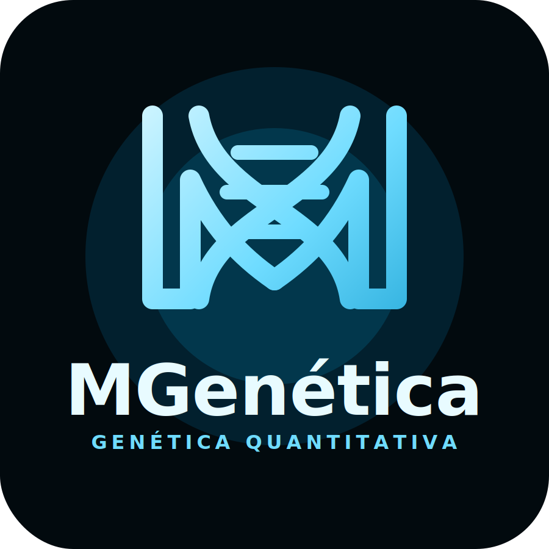

::: {.profile-hero}
::: {.profile-logo}
{fig-alt="Logo do MGenética"}
:::

::: {.profile-copy}
# Seu nome aqui

Use esta página para reunir suas informações profissionais, acadêmicas e técnicas. Substitua os textos abaixo por seu currículo, projetos, artigos, links e contatos.

::: {.profile-actions}
[Currículo](#curriculo){.btn .btn-primary}
[Projetos](#projetos){.btn .btn-secondary}
[Artigos](#artigos){.btn .btn-secondary}
:::
:::
:::

## Currículo

::: {.profile-section}
### Formação

- Graduação:
- Mestrado:
- Doutorado:
- Cursos e certificações:

### Experiência

- Cargo ou atuação:
- Instituição/empresa:
- Período:
- Principais atividades:

### Áreas de interesse

- Melhoramento animal
- Genética quantitativa
- Genômica aplicada
- Bioinformática e análise de dados em R
:::

## Projetos

::: {.profile-grid}
::: {.profile-card}
### Projeto 1

Descreva o objetivo, metodologia, tecnologias usadas e resultados principais.
:::

::: {.profile-card}
### Projeto 2

Inclua links para repositórios, relatórios, dashboards, materiais de aula ou publicações relacionadas.
:::

::: {.profile-card}
### Projeto 3

Use este espaço para projetos de pesquisa, extensão, ensino ou consultoria.
:::
:::

## Artigos

::: {.profile-section}
- **Título do artigo**. Autores. Periódico, ano. DOI/link.
- **Título do artigo**. Autores. Periódico, ano. DOI/link.
- **Título do artigo**. Autores. Periódico, ano. DOI/link.
:::

## Contato

::: {.profile-section}
- E-mail:
- Lattes:
- ORCID:
- GitHub:
- LinkedIn:
:::
